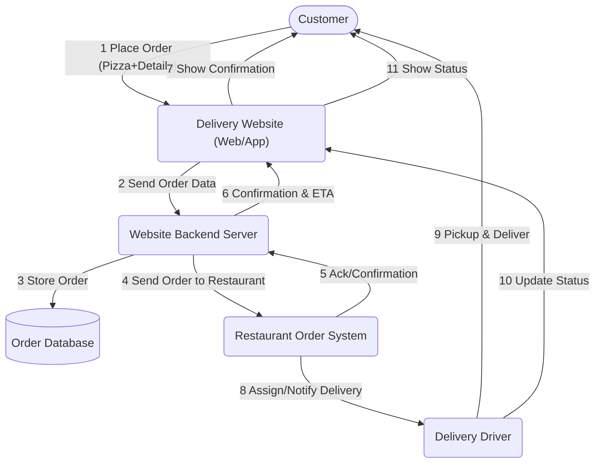
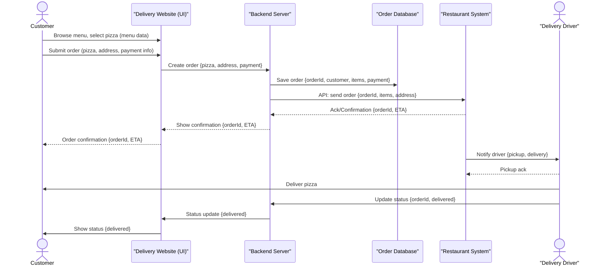

# E-Collecting Hackathon – Team Title

*Over the course of two days, you will develop your solution for collecting electronic signatures for popular initiatives and referendums from A to Z, addressing the **10** topics outlined in the guidelines **(add link to updated version)**. Your prototype can be conceptual, clickable, and/or technical. Either way, you should clearly present the interactions and data flows between actors, software, and infrastructure components over time, as well as the user experience of these actors.*

## Approach

*A brief description of your approach, a link/reference to the detailed description of your approach and what you have already created (if applicable). Please also mention which skills you need for your team.*

## Documentation and Diagrams

*Together, you will contribute to comparing different ways of how to implement e-collecting in Switzerland from A to Z. As part of the [participatory process](https://www.bk.admin.ch/bk/de/home/politische-rechte/e-collecting/partizipativer_prozess.html), your solutions will be discussed in subsequent workshops and will possibly be taken into account for the official decision on the design of the federal e-collecting trials. Proper documentation is key to ensuring that your solution can be understood and evaluated:*

1. **[Mermaid](https://mermaid.js.org/) diagram(s) showing interactions and data flows between actors, software and infrastructure components of your solution over time.**
2. **Wireframes or mockups with user flow showing the user experience of different actors** (using e.g. Figma)
3. Explain how you addressed the topics presented in the **guidelines LINK**, filling in the template below.
4. List the key strengths and weaknesses of your solution.
5. Explanation of features used (if applicable)
6. A requirements file with all packages and versions used (if applicable)
7. Environment code to be run (if applicable)

*For your reference, you will find below an example of two diagrams showing interactions and data flows between actors, software and infrastructure components of ordering a pizza via a third-party delivery website over time. Please replace them with diagrams for your solution.*

### Flowchart: High-level Process (Example)

*An overall process flow showing the main steps and system/actor interactions for ordering a pizza online via a delivery website, including software, infrastructure, and handoff to the restaurant and delivery driver.*

### Sequence Diagram: Detailed Interactions & Data Flows (Example)

*A step-by-step illustration showing how data and requests are exchanged between actors (customer, delivery site, restaurant, infrastructure), and key software components in the order process.*

## User Experience

*Add or reference wireframes or mockups with user flow showing the user experience of different actors.*

## Topics addressed

*Explain how you addressed the topics presented in the **guidelines LINK**, filling in the template below.*

| Topic | (How) is it addressed? |
| -| ------- |
| 1 |  |
| 2 |  |
| 3 |  |
| ... |  |

## Key Strenghts and Weaknesses

*List the key strengths and weaknesses of your solution.*

### Strengths:
- ...
- ...

### Weaknesses:
- ...
- ...

## Getting Started

*These instructions will get you a copy of the technical prototype (if applicable) up and running on your local machine for development and testing purposes. **If you are not developing a technical prototype, please present or reference your conceptual and/or clickable prototype.***

### Prerequisites

*What things you need to install the software and how to install them.*

### Installation

*A step by step series of examples that tell you how to get a development env running.*

## Contributing

Please read [CONTRIBUTING.md](/CONTRIBUTING.md) for details on our code of conduct.

## Team Members

- Name/GitHub Account (role)
- Name/GitHub Account (role)
- Name/GitHub Account (role)
- ...

## License

This software is licensed under a AGPL 3.0 License - see the [LICENSE](LICENSE) file for details. Please feel free to [choose any other](https://choosealicense.com/) [Open Source Initiative approved license](https://opensource.org/licenses) (e.g. a permissive license such as [MIT](https://opensource.org/license/mit)). Other content (e.g. text, images, etc.) is licensed under a [Creative Commons CC BY-SA 4.0 license](https://creativecommons.org/licenses/by-sa/4.0/deed.de). Exceptions are possible in consultation with the organizers.
