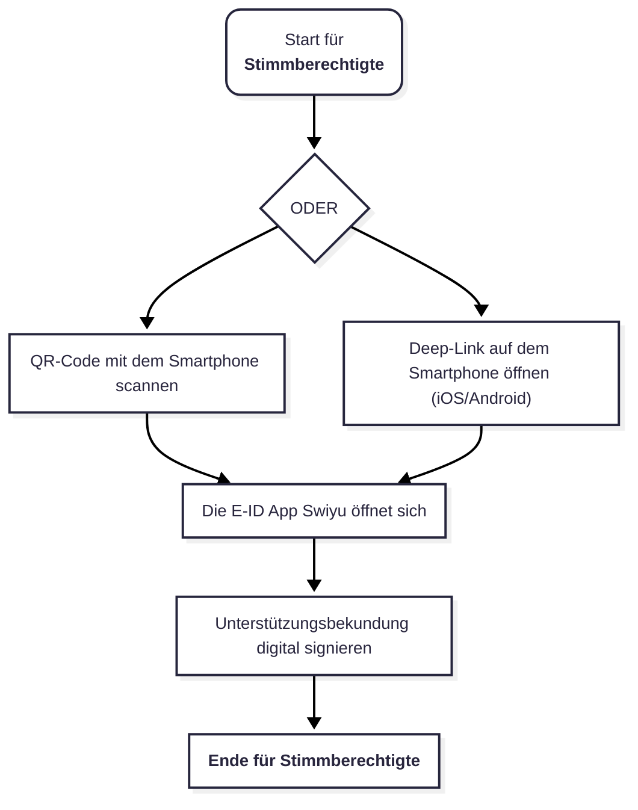

# 9) Prosignum - sicher und verifizierbare Unterschriftensammlung 

## Approach
Prosignum ist ein **föderal funktionsfähiges, datenschutzwahrendes und kryptografisch verifizierbares System zur elektronischen Unterschriftensammlung**. 
Es kann parallel zum Papierkanal betrieben werden.
Wir legen dabei besonderen Wert auf Sicherheit, Privatsphäre, Verifizierbarkeit, und föderale Anschlussfähigkeit[^2][^3]. 

### Designprinzipien
- **Sicherheitsorientiertes Design**: Wir möchten jeden Schritt auf Bedrohungen analysieren und diese bewusst dokumentieren, damit Trade-offs, Vertrauensannahmen sowie Vertrauensgrenzen klar dokumentiert sind.
- **Einfache Implementierbarkeit**: Wir möchten das Verfahren bewusst so konzipieren, dass es ohne hohe organisatorische oder technologische Hürden von allen wichtigen Stakeholdern implementiert werden kann.
- **Mehrstufiger, evolutionärer Ansatz**: Wir schlagen vor, dass in den ersten Iterationen des digitalen Systems möglichst wenig Komplexität (z.B. etablierte statt experimenteller, nicht formell verifizierte, Kryptographie) verwendet wird. Vor allem, da ein Ansatz mit Differential Privacy (z.B. dass die Bundeskanzlei nur noch aggregierte Resultate erhalten würde) gewisse Gesetzesänderungen voraussetzt. Wir fokussieren uns im Hackathon daher auf eine jetzt sinnvolle und möglichst sichere Umsetzung. Die Evolutionsschritte werden im folgenden Abschnitt dargestellt.

### Evolutionäre Entwicklung der Prosignum-Implementierung
Die folgenden Phasen skizzieren wie eine schrittweise Weiterentwicklung des E-Collecting-Systems aussehen könnte. Die Erfahrungen und Ergebnisse jeder Phase würden dabei direkt in die Gestaltung der nachfolgenden Phasen einfliessen. Ob und wie genau diese Phasen durchlaufen werden, lässt sich derzeit nicht abschließend beurteilen.

**Für den Hackathon fokussieren wir uns auf Phase 1, entwickeln gegebenenfalls aber bereits Ansätze für spätere Phasen.**

#### **Phase 1: Pragmatischer Datenschutz**
- **Fokus**: Organisatorische Sicherheit und funktionale Grundlagen ohne komplexe Kryptographie
- **Features**:
  - E-ID Integration für sichere Authentifizierung
  - Digitale Signierung der Unterstützungsbekundung
  - Parallelbetrieb mit Papierkanal
  - Einfache Verifizierung durch Stimmregister
- **Vorteile**: Schnelle Einführung, geringe technische Hürden für Gemeinden

#### **Phase 2: Erweiterte Sicherheit**
- **Fokus**: Verbesserte kryptografische Verfahren
- **Potenzielle Features**:
  - Potenzielle Erweiterung durch Schema aus[^1]
  - Zero-Knowledge-Proofs (ZKP) für Stimmberechtigung
  - Verteilte Verifizierung durch mehrere Stimmregister
  - Anonymisierte Zwischenstände
  - Post-Quantum-sichere Kryptographieverfahren

#### **Phase 3: Vollständige Privacy-Implementierung**
- **Fokus**: Maximaler Datenschutz mit Differential Privacy
- **Potenzielle Features**:
  - Homomorphe Verschlüsselung der Unterstützungsbekundungen
  - Bundeskanzlei erhält nur aggregierte, anonymisierte Resultate
  - Vollständig verteiltes System ohne Vertrauen in zentrale Instanzen
  - Möglicher Verzicht auf Papierkanal
- **Voraussetzung**: Gesetzesanpassungen, umfassende technische Infrastruktur

Jede Phase baut auf den Erfahrungen der vorherigen auf und ermöglicht ein iteratives Vorgehen mit kontinuierlicher Verbesserung.

### **Gesuchte Ergänzungen fürs Team**
 Um den Ansatz zu stärken, suchen wir Unterstützung vor allem in nicht-technischen Bereichen:
- **Politisches und staatsrechtliches Know-how** – sowie Wissen zu direktdemokratischen Verfahren, Bundesrecht, politischen Rechten und institutionellen Abläufen.    
- **User Experience / Accessibility** - Unterstützung in Benutzerfreundlichkeit und Barrierefreiheit.
-   **Kenntnisse der E-ID-Infrastruktur** – technische und organisatorische Einbindung der nationalen E-ID sowie der föderalen Stimmregistersysteme.
-   **Verwaltungs- und Prozesswissen** – Verständnis für föderale Zuständigkeiten, Abläufe auf Gemeinde- und Kantonsebene sowie Schnittstellen zu bestehenden IT-Systemen (z. B. AGOV, allfällige kantonsspezifische Infrastruktur).

## Documentation and Diagrams
`TODO`

### Flowchart: High-level Process

#### Für Stimmberechtigte

### Sequence Diagram: Detailed Interactions & Data Flows 
`TODO`

## User Experience
`TODO`

## Potenzielle Erweiterung in Richtung Phase 2
In 

## Topics addressed
The following table discusses the topics presented in the [guidelines](https://www.bk.admin.ch/bk/de/home/politische-rechte/e-collecting/aktuelles.html).*

| Topic | Title (DE/EN) | (How) is it addressed? |
| -| ------------- | ------- |
| 1 | **Vom Unterstützungswillen zur Unterstützungsbekundung** / From the Will to Support to the Declaration of Support | Prosignum bietet drei nahtlos integrierte Eingabekanäle: (1) QR-Code-Scan für persönliche Sammlungen vor Ort, (2) Desktop-Webinterface für Unterschriften von zu Hause, (3) Deep-Links für mobile Geräte (iOS/Android), die direkt die Swiyu-App öffnen. Die E-ID-Authentifizierung stellt sicher, dass nur berechtigte Personen unterschreiben können. |
| 2 | **Zugang zu aktuellen Informationen über die eingereichten Unterstützungsbekundungen** / Access to Current Information on Submitted Declarations of Support | Die Unterstützungsbekundungen werden in Echtzeit sowohl im jeweiligen kommunalen Stimmregister als auch auf der zentralen E-Collecting-Plattform der Bundeskanzlei gespeichert. Komitees erhalten Dashboard-Zugriff mit aktuellen Zahlen zum Sammelstand. Die föderale Architektur ermöglicht, dass sowohl Gemeinden als auch die Bundeskanzlei stets aktuelle Informationen haben. |
| 3 | **Zuschreibung der Unterstützungsbekundungen an Komitees und Sammelunternehmen** / Attribution of Declarations of Support to Committees and Collection Companies | Denkbar sind personalisierte Tracking-Links für jedes Komitee und jedes Sammelunternehmen. Jeder Link enthält eine eindeutige ID, die bei der Unterschrift gespeichert wird. Dies ermöglicht transparente Attribution (z.B. für Online-Werbung, Tablet-Sammlungen) und die Messung des Impacts für verschiedene Sammelkanäle. Die Zuordnung erfolgt automatisch und ohne zusätzlichen Aufwand für Stimmberechtigte. |
| 4 | **Unterbreitung von Argumenten der Komitees via E-Collecting** / Submission of Committee Arguments via E-Collecting | In Phase 1 zeigt das System die offiziellen Formvorschriften prominent an. Komitees können zusätzliche Argumente in einem klar abgegrenzten Bereich vorbringen. Barrierefreiheit sollte durch Screenreader-Kompatibilität und alternative Textformate gewährleistet werden. In späteren Phasen könnte eine moderierte Argumentenplattform implementiert werden. |
| 5 | **Ausschluss unrechtmässiger Unterstützungsbekundungen** / Exclusion of Unlawful Declarations of Support | Dreistufige Sicherheit: (1) E-ID-Login mit starker Authentifizierung gewährleistet die Identität, (2) Digitale Signatur jeder Unterstützungsbekundung, (3) Manuelle Prüfung und Deduplizierung durch Gemeinden vor Rückgabe an die Datenbank verhindern Mehrfachunterschriften. |
| 6 | **Verhinderung unterschlagener Unterstützungsbekundungen** / Prevention of Embezzled Declarations of Support | Noch nicht adressiert. |
| 7 | **Wahrung des Stimmgeheimnisses** / Protection of Voting Secrecy | Phase 1: Verschlüsselte Datenbank mit getrennter Speicherung von Identität und Unterstützung. Sofortige Verschlüsselung nach Eingang. Zugriff nur mit Vier-Augen-Prinzip. Phase 2 und 3: Anwendung von Zero-Knowledge-Proofs zur Nachweisung der Stimmberechtigung. Evt. Homomorphe Verschlüsselung – Bundeskanzlei erhält nur aggregierte Resultate ohne Personenbezug. |
| 8 | **Integration mit dem papierbasierten Prozess** / Integration with the Paper-Based Process | Hybridmodell mit vollständiger Integration: QR-Codes auf Papierbögen führen zum digitalen System. Bei Papiereingang prüfen Gemeinden automatisch die E-Collecting-Datenbank auf Duplikate. Der Adapter für elektronische Stimmregister synchronisiert beide Kanäle. Gemeinden können digital eingereichte Unterschriften für manuelle Prozesse ausdrucken. |
| 9 | **Erleichterte Einführung für Gemeinden mit Effizienzgewinn; auf der Grundlage bestehender Infrastruktur und Prozesse** / Facilitated Introduction for Municipalities with Efficiency Gains; Based on Existing Infrastructure and Processes | Modulare Architektur ermöglicht stufenweise Einführung: Gemeinden ohne digitale Infrastruktur nutzen ein Web-Portal oder erhalten PDF-Exporte. Standardisierte APIs für bestehende Stimmregister-Software. Automatische Bescheinigung reduziert manuellen Aufwand.|
| 10 | **E-Collecting für alle föderalen Ebenen** / E-Collecting for All Federal Levels | Föderale Multi-Tenancy-Architektur: separate Instanzen für Bund, Kantone und Gemeinden mit standardisierten Schnittstellen. Konfigurierbare Workflows für unterschiedliche Anforderungen. Gemeinsame E-ID-Infrastruktur als Basis. Hierarchische Berechtigungen ermöglichen kantonale und kommunale Sammlungen parallel zu den eidgenössischen. Interoperabilität durch offene Standards.

## Key Strenghts and Weaknesses
`TODO`

### Strengths:
- ...
- ...

### Weaknesses:
- ...
- ...

## Getting Started
`TODO`

*These instructions will get you a copy of the technical prototype (if applicable) up and running on your local machine for development and testing purposes. **If you are not developing a technical prototype, please present or reference your conceptual and/or clickable prototype.***

### Prerequisites

*What things you need to install the software and how to install them.*

### Installation

*A step by step series of examples that tell you how to get a development env running.*

## Contributing

Please read [CONTRIBUTING.md](/CONTRIBUTING.md) for details on our code of conduct.

## Team Members

- Christian Killer / [acuraster](https://github.com/acuraster) (Team-Co-Lead)
- Alessandro de Carli / [dcale](https://github.com/dcale) (Team-Co-Lead)
- Andreas Gassmann / [AndreasGassmann](https://github.com/AndreasGassmann) 
- Lukas Schönbächler / [lukeisontheroad](https://github.com/lukeisontheroad)
- Michelle Fund / [michellefund](https://github.com/michellefund) 
- William Dan / [william-dan](https://github.com/william-dan)
- Hao Wang / [haowangcoder](https://github.com/haowangcoder)

## License

This software is licensed under a AGPL 3.0 License - see the [LICENSE](LICENSE) file for details. Please feel free to [choose any other](https://choosealicense.com/) [Open Source Initiative approved license](https://opensource.org/licenses) (e.g. a permissive license such as [MIT](https://opensource.org/license/mit)). Other content (e.g. text, images, etc.) is licensed under a [Creative Commons CC BY-SA 4.0 license](https://creativecommons.org/licenses/by-sa/4.0/deed.de). Exceptions are possible in consultation with the organizers.

## References

[^1]: Moser, Florian (2025). E-Collecting in Switzerland: Status Quo, Setting & Proposals. Document prepared for the E-Collecting Hackathon organized by the Federal Chancellery of Switzerland, 31.10.-01.11.2025. With feedback contributions from Christian Killer, Audhild (INRIA Nancy), and E-Voting BFH. Available at: [Link](https://github.com/swiss/e-collecting-hackathon-team9/blob/main/docs/references/moser_2025.pdf)

[^2]: Gfeller, Katja, Andreas Glaser, and Irina Lehner (2021). "E-Collecting: Umsetzungsvarianten und Rechtsetzungsbedarf" [E-Collecting: Implementation Variants and Legislative Requirements]. LeGes – Gesetzgebung & Evaluation, 32(1), 1–15. Available at: https://leges.weblaw.ch/legesissues/2021/1/e-collecting--umsetz_4ac1c3bc14.html

[^3]: Bühlmann, Marc and Hans-Peter Schaub (2023). Staatspolitische Auswirkungen von E-Collecting: Studie im Auftrag der Bundeskanzlei [Political Impacts of E-Collecting: Study Commissioned by the Federal Chancellery]. Bern: Année Politique Suisse, Institut für Politikwissenschaft, Universität Bern. Available at: https://www.newsd.admin.ch/newsd/message/attachments/90666.pdf
