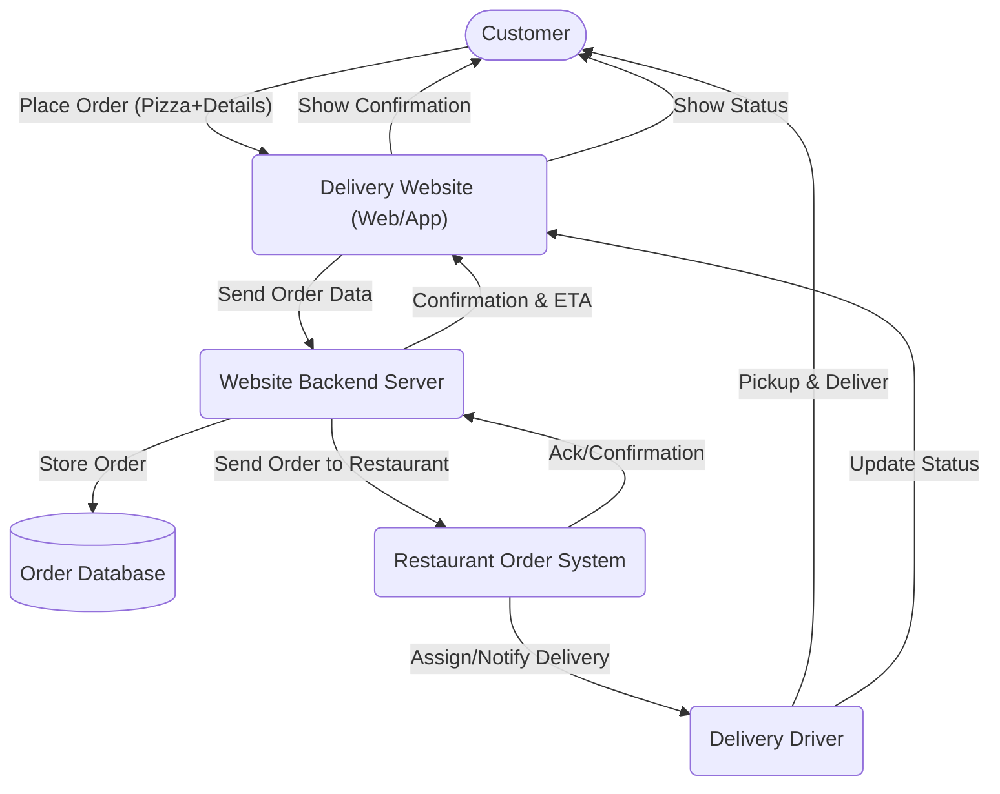
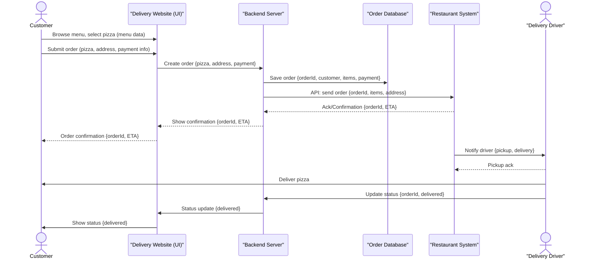

# E-Collecting Hackathon – Team 1

> This hackathon contributes to laying out different ways on how to implement e-collecting in Switzerland. Proper documentation is key to ensuring that your solution can be understood and evaluated:
>
> 1) **[Mermaid](https://mermaid.js.org/) diagram(s)** showing interactions and data flowing between actors, software and infrastructure components of your solution
> 2) Figma Mockups/wireframes and user flow showing the user experience of your solution
> 3) Explanation of features used (if applicable)
> 4) A requirements file with all packages and versions used (if applicable)
> 5) Environment code to be run (if applicable)

## Approach

*A brief description of your approach.*

## Architecture and Data Flows

*Find below an example for an architecture and a data flow diagram*

## Getting Started

*These instructions will get you a copy of the project up and running on your local machine for development and testing purposes.*

### Prerequisites

*What things you need to install the software and how to install them.*

### Installation

*A step by step series of examples that tell you how to get a development env running.*

## Contributing

Please read [CONTRIBUTING.md](/CONTRIBUTING.md) for details on our code of conduct.

## Group Members

- First Name (role)
- First Name (role)
- First Name (role)

## License

This project is licensed under MIT License - see the [LICENSE](LICENSE) file for details.
