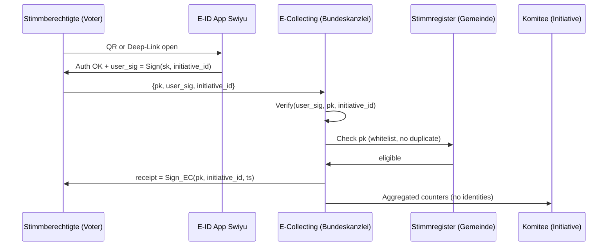
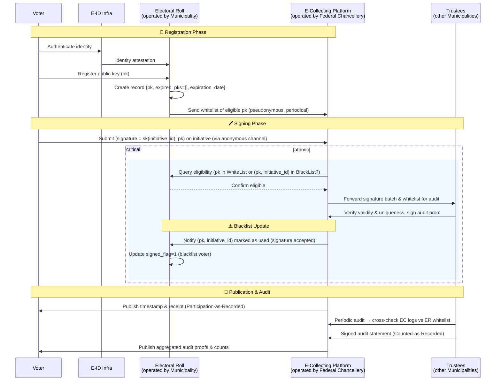

# Phase 2 Draft
This document contains drafts and process diagrams that outline potential solutions for Phase 2, which basically applies the scheme proposed in[^1].

## TODO add content here
We try to make a progressive update from phase 1 so that there is no sudden jump from simple to complex model. The minimal sequence diagram for phase 2 based on the phase 1 is:

Here is the experimental exploration of the more concrete version of protocol:

# References
[^1]: Moser, Florian (2025). E-Collecting in Switzerland: Status Quo, Setting & Proposals. Document prepared for the E-Collecting Hackathon organized by the Federal Chancellery of Switzerland, 31.10.-01.11.2025. With feedback contributions from Christian Killer, Audhild (INRIA Nancy), and E-Voting BFH. Available at: [Link](https://github.com/swiss/e-collecting-hackathon-team9/blob/main/docs/references/moser_2025.pdf)
