# Phase 2 Draft
This document contains drafts and process diagrams that outline potential solutions for Phase 2, which basically applies the scheme proposed in[^1].

## TODO add content here
We try to make a progressive update from phase 1 so that there is no sudden jump from simple to complex model. The minimal sequence diagram for phase 2 based on the phase 1 is:

Here is the experimental exploration of the more concrete version of protocol:

```mermaid
sequenceDiagram
    participant V as Voter
    participant EID as E-ID Infra
    participant ER as Electoral Roll <br> (operated by Municipality)
    participant EC as E-Collecting Platform <br> (operated by Federal Chancellery)
    participant TR as Trustees <br> (other Municipalities)

    Note over V,EC: 🔐 Registration Phase
    V->>EID: Authenticate identity
    EID->>ER: Identity attestation
    V->>ER: Register public key (pk)
    ER->>ER: Create record {pk, expired_pks=[], expiration_date}
    ER->>EC: Send whitelist of eligible pk (pseudonymous, periodical)

    Note over V,TR: 🖊️ Signing Phase
    V->>EC: Submit (signature = sk(initiative_id), pk) on initiative   (via anonymous channel)
    critical atomic 
    rect rgb(240, 248, 255)
        EC->>ER: Query eligibility (pk in WhiteList or (pk, initiative_id) in BlackList?)
        ER-->>EC: Confirm eligible

        EC->>TR: Forward signature batch & whitelist for audit
        TR->>EC: Verify validity & uniqueness, sign audit proof
    Note over EC,ER: ⚠️ Blacklist Update
    EC->>ER: Notify (pk, initiative_id) marked as used (signature accepted)
    ER->>ER: Update signed_flag=1 (blacklist voter)
    end
    end

    Note over V,TR: 🧮 Publication & Audit
    EC->>V: Publish timestamp & receipt (Participation-as-Recorded)
    TR->>EC: Periodic audit → cross-check EC logs vs ER whitelist
    TR->>EC: Signed audit statement (Counted-as-Recorded)
    EC->>V: Publish aggregated audit proofs & counts

```

## Strengths and Weaknesses

### Stärken

**Klare Rollen.** App = Authentifizierung+Signatur, EC = Annahme+Quittung+Zählung, ER = Berechtigung, CC = informiert — leicht zu bauen und zu erklären.

**Echtzeit-Berechtigung.** Die EC→ER-Prüfung blockiert die meisten ungültigen Eingaben frühzeitig.

**Nutzerquittung.** Eine „Bestätigung/Quittung“ zeigt, dass die Unterstützung gezählt wurde, und hilft bei Streitfällen.

**Authentifizierung an Swiyu delegiert.** Keine Neuimplementierung der Authentifizierung, erhöht die Sicherheit. Swiyu kann das Ablaufdatum öffentlicher Schlüssel festlegen und Wählende nach Ablauf zur erneuten Zustimmung zu neuen Schlüsselpaaren auffordern.

**Zugänglichkeit für das Komitee.** Das Komitee wird über das Ergebnis informiert.

------

### Schwächen

**Kein theoretischer Sicherheitsnachweis des Protokolls.**

**Verknüpfbarkeit & Privatsphäre.** Die Wiederverwendung einer stabilen ID/eines Schlüssels über Initiativen hinweg ermöglicht das Profilen der Interessen einer wählenden Person.

**Single Point of Trust.** EC/ER sind zentral; es gibt keine unabhängige Prüfkette oder Mehrparteien-Attestierung.

# References
[^1]: Moser, Florian (2025). E-Collecting in Switzerland: Status Quo, Setting & Proposals. Document prepared for the E-Collecting Hackathon organized by the Federal Chancellery of Switzerland, 31.10.-01.11.2025. With feedback contributions from Christian Killer, Audhild (INRIA Nancy), and E-Voting BFH. Available at: [Link](https://github.com/swiss/e-collecting-hackathon-team9/blob/main/docs/references/moser_2025.pdf)
